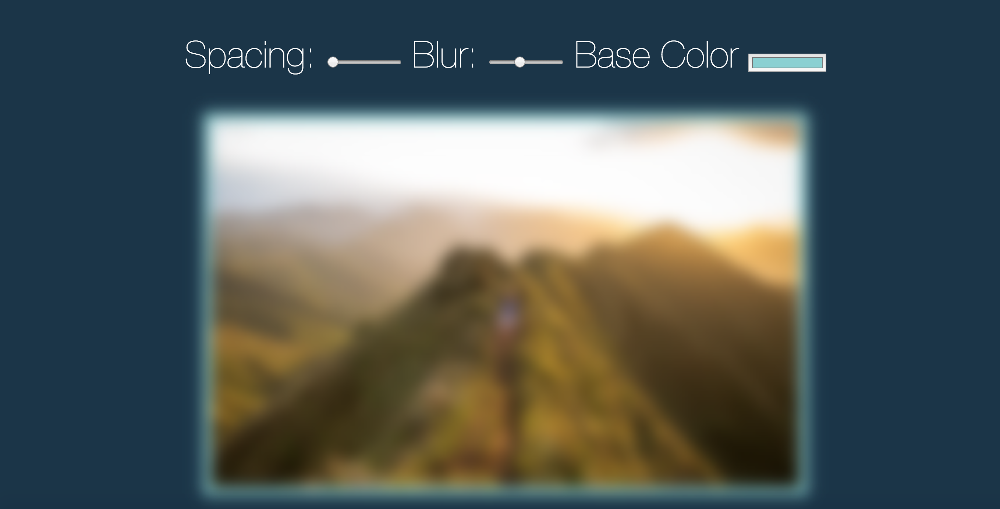

# Playing with CSS variables and JS



## Objective:

- Understand the difference between Sass and CSS variables
-  CSS variables can have their values updated through JavaScript
- The input HTML elements in the file have a name property that cooresponds with the CSS properties
- Creating and attaching CSS variables at the root element allows JavaScript to change the inputs through event listeners

```  :root{
      --base: #88D0D2;
      --spacing: 10px;
      --blur: 10px;
    }```